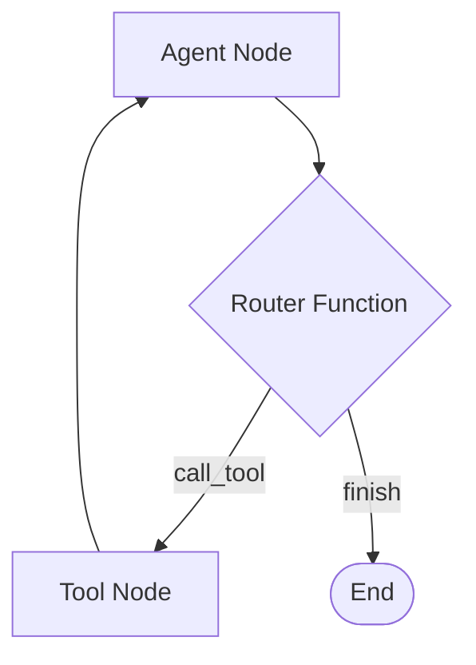

# 04 — State Reducers & Conditional Routing

> **Goal:** Master state merging logic using Pydantic/TypedDict Reducers, build conditional routing edges, and construct cyclic agent loops (loops).

---

## 1. What is a State Reducer?

By default, when a node returns a dictionary like `{"value": 10}`, LangGraph **overwrites** the key `value` in the global state with `10`.

However, for keys like message history or logs, you want to **append** updates rather than overwrite them. You do this using **reducers**.

### The `add` Reducer
LangGraph provides a helper operator called `add` (imported from `langchain_core.messages` or custom logic) that appends elements to lists or merges dicts.

```python
from typing import Annotated, TypedDict
from operator import add

class AgentState(TypedDict):
    task: str
    # Annotated tells LangGraph to use the 'add' function to merge updates for this key
    logs: Annotated[list[str], add] 
```

Let's see the lifecycle:
1. Initial State: `{"task": "Run", "logs": ["Start"]}`
2. Node A returns: `{"logs": ["Task A completed"]}`
3. Resulting State: `{"task": "Run", "logs": ["Start", "Task A completed"]}`

---

## 2. Dynamic Routing: Conditional Edges

Instead of static transitions, you can route the control flow dynamically based on the current values in the state. You define:
1. A **routing function** that examines the state and returns a string (the name of the next path).
2. A **conditional edge** mapping these return strings to specific nodes.



---

## 3. Code Example: A Simple Cyclic Agent

Let's build a math agent that receives an equation, checks if it needs to calculate, and executes tools. We'll use the pre-built `add` reducer for message history (`messages: Annotated[list, add]`).

```python
from typing import Annotated, TypedDict, Literal
from operator import add
from langchain_core.messages import BaseMessage, HumanMessage, AIMessage, ToolMessage
from langchain_core.tools import tool
from langchain_openai import ChatOpenAI
from langgraph.graph import StateGraph, START, END

# Define local tool
@tool
def multiply(a: int, b: int) -> int:
    """Multiplies two integers."""
    return a * b

tools = [multiply]

# Define state with message reducer
class MessageState(TypedDict):
    messages: Annotated[list[BaseMessage], add]

# 1. Define Node: The Agent
model = ChatOpenAI(model="gpt-4o-mini").bind_tools(tools)

def call_model(state: MessageState):
    messages = state["messages"]
    response = model.invoke(messages)
    # Return updates to append to the messages list
    return {"messages": [response]}

# 2. Define Node: Tool Executor (Manual)
def execute_tools(state: MessageState):
    messages = state["messages"]
    last_message = messages[-1]
    
    tool_outputs = []
    for tool_call in last_message.tool_calls:
        # Find and execute tool
        if tool_call["name"] == "multiply":
            args = tool_call["args"]
            res = multiply.invoke(args)
            # Create a ToolMessage with the output
            tool_msg = ToolMessage(
                content=str(res), 
                tool_call_id=tool_call["id"], 
                name=tool_call["name"]
            )
            tool_outputs.append(tool_msg)
            
    return {"messages": tool_outputs}

# 3. Define routing function
def should_continue(state: MessageState) -> Literal["tools", "end"]:
    messages = state["messages"]
    last_message = messages[-1]
    # Check if LLM requested a tool call
    if hasattr(last_message, "tool_calls") and last_message.tool_calls:
        return "tools"
    return "end"
```

---

## 4. Assembling the Cyclic Graph

Let's compose the graph using conditional routing edges.

```python
builder = StateGraph(MessageState)

# Add Nodes
builder.add_node("agent", call_model)
builder.add_node("tools", execute_tools)

# Define edges
builder.add_edge(START, "agent")
builder.add_edge("tools", "agent")  # Loop back to agent after running tools

# Add Conditional Edge from agent
builder.add_conditional_edges(
    "agent",
    should_continue,
    {
        "tools": "tools",  # If should_continue returns "tools", go to tools node
        "end": END         # If should_continue returns "end", terminate
    }
)

graph = builder.compile()
```

### Running the loop:
```python
inputs = {"messages": [HumanMessage(content="What is 4 times 8?")]}
result = graph.invoke(inputs)

for msg in result["messages"]:
    print(f"[{type(msg).__name__}]: {msg.content or msg.tool_calls}")
```

Expected Output Trajectory:
1. `[HumanMessage]`: What is 4 times 8?
2. `[AIMessage]`: Requests `multiply(a=4, b=8)`.
3. `[ToolMessage]`: Outputs `32`.
4. `[AIMessage]`: Final response: "4 times 8 is 32."

---

## 5. Summary Exercises

1. **Exercise 1 (Parallel Tools):** Verify that the math loop handles multiple parallel tool calls (e.g. "What is 4 times 8 and 3 times 3?"). Trace the message logs to confirm both tools run in the same step.
2. **Exercise 2 (Safe Divisor Tool):** Add a division tool. Add validation code to prevent dividing by zero. If a division by zero error occurs, have the tool node return an error message to the agent so it can self-correct.

---

* [next → 05_persistence_and_human_in_the_loop.md](./05_persistence_and_human_in_the_loop.md)*
* [← back to Module 03](./03_langgraph_foundations.md)*
